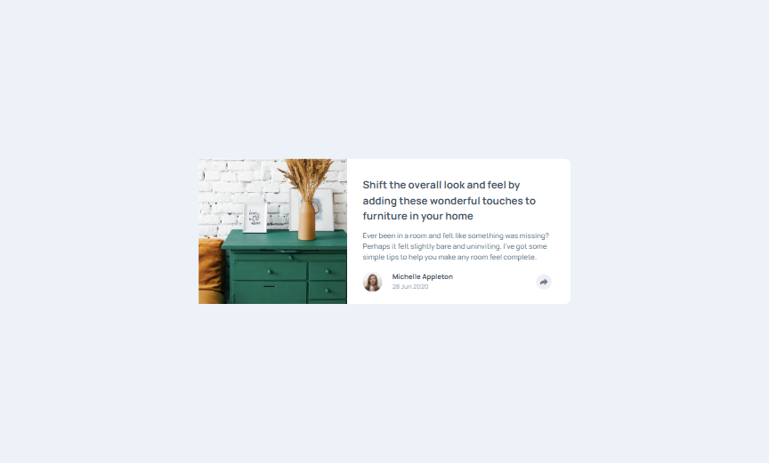

# Frontend Mentor - Article preview component solution

This is a solution to the [Article preview component challenge on Frontend Mentor](https://www.frontendmentor.io/challenges/article-preview-component-dYBN_pYFT). Frontend Mentor challenges help you improve your coding skills by building realistic projects.

## Table of contents

- [Overview](#overview)
  - [The challenge](#the-challenge)
  - [Screenshot](#screenshot)
  - [Links](#links)
- [My process](#my-process)
  - [Built with](#built-with)
  - [What I learned](#what-i-learned)
  - [Continued development](#continued-development)
- [Author](#author)


## Overview

### The challenge

The challenge is to build out this article preview component and get it looking as close to the design as possible. Use JavaScript to initiate the share options when someone clicks the share icon.

Users should be able to:

- See the social media share links when they click the share icon
- View the optimal layout for each page depending on their device's screen size
- See hover states for all interactive elements on the page

### Screenshot



### Links

- Solution URL: [github](https://github.com/artemkotko14/article_preview_component)
- Live Site URL: [webpage](https://artemkotko14.github.io/article_preview_component/)

## My process

### Built with

- Semantic HTML5 markup
- Flexbox
- CSS Grid
- Mobile-first workflow
- JavaScript

### What I learned

I learned how to create a triangular shape with CSS:

```css
 &::after {
      content: '';
    position: absolute;
    top: 100%; /* Place the triangle just below the div */
    left: 50%;
    transform: translateX(-50%);
    border-width: 10px;
    border-style: solid;
    border-color: $very-dark-grayish-blue transparent transparent transparent;
```

I learnt how to check current height or width of my div element:

```js
const div = document.getElementById("myDiv");
const height = div.offsetHeight; // Includes padding and borders
console.log("Height of the div:", height + "px");
```
Also I know now how to check a background-color of a specific element if I need to:
```js
const element = document.querySelector('my-element-selector(class or id)');
console.log(getComputedStyle(element).backgroundColor);
```
I also learnt about event listener when we resize a page:

```js
window.addEventListener("resize", updateShareDiv);
```
### Continued development

In future projects I want to focus on practicing my javascript skills.

## Author

- Github - [Artem Kotko](https://github.com/artemkotko14)
- Frontend Mentor - [@artemkotko14](https://www.frontendmentor.io/profile/artemkotko14)
